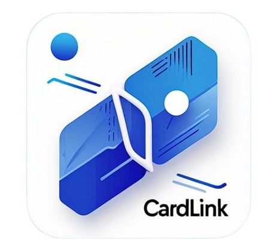

# 💼 CardLink - The Future of Business Cards

CardLink is a smart mobile application designed to revolutionize how professionals manage business cards. Say goodbye to bulky card holders and hello to seamless digital contact management powered by **OCR**, **NLP**, and a clean intuitive UI.

---

## 🚀 Features

- 📷 **Scan Business Cards** with your phone camera or upload from gallery
- 🧠 **Extract Key Info** using Google ML Kit + NLP (BERT + regex fallback)
- 🗂 **Organize Contacts** with tags, filters, and search
- 📝 **Add Notes & Reminders** for each contact
- 📅 **Schedule Appointments** directly in the app
- 🔒 **Secure & Scalable Backend** using Node.js + MongoDB

---

## 🧠 Problem We Solve

- Physical cards are **easy to lose** and **hard to organize**
- Manual entry is **time-consuming** and **error-prone**
- No easy way to **search**, **tag**, or **follow-up** with contacts

> **90.6%** of our survey participants said they prefer digital business cards!

---
